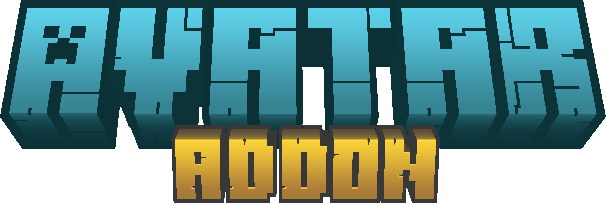

  
## 

This addon simply adds the four nations bending abilities from the show Avatar the last Airbender!

## 

When you start out, a scroll will appear in your inventory. It should look the exact same as the image below. After that, you can choose your bending by opening it (long press or right click).

//image

  
The options are avatar, fire, earth, water, air, and human (normal vanilla Minecraft, with the ability to learn chi-blocking).   

//image                                                                                                        

 
Nothing will happen when you pick a bending style - you need to choose your moves for each of your “slots”. For instance, if you sneak and then punch you will use whatever move is bound to slot 4. Let’s say you are an Airbender and used the scroll to set slot 4 to Air Blast - when you sneak and punch, you will use Air Blast. You can use your scroll to bind moves to slots. Just right-click on your scroll, and click on the sub-menu button “Choose Slots”. Try picking slot 4 first, since it’s the simplest. Eventually, you’ll have your slots memorized, and a set of 4 moves you like best. These 4 that you have “slot-loaded” is what makes you different from other benders of the same type.
  

//image

 
Each type of bender will have a different moveset, and each individual bender will have an even more varied set of moves. As you level up, you get access to more moves. To level up, simply go about as normal - using moves will help you level up, but don’t try to afk, it won’t work.

Sometimes, bending can get annoying while just going about your normal tasks, so you can turn it off for a bit by holding arrows in your off-hand, or by right clicking your scroll and editing your settings.

The moves and abilities of these classes are outlined below, and also in-game with the scroll.
  
## 
Once you have identified the slots and abilities, you can use them:

* Slot 1: Look up and sneak to trigger whatever move you have for slot 1.
* Slot 2: Look down and punch to trigger whatever move you have for slot 2.
* Slot 3: Double sneak (sneak twice quickly) to trigger whatever move you have for slot 3.
* Slot 4: Sneak and punch to trigger whatever move you have for slot 4.

Have fun with them in-game!

 

Air Blast

  
 Shoots a focused beam of air that does damage and knockback.

 

Air Blast

 
  TEstyest 
 

